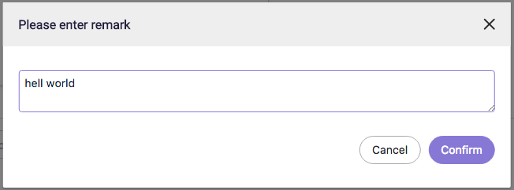

# A text input dialog component based on Element-UI

Preview:



Prerequisite:

element-ui/lib/dialog
element-ui/lib/button
element-ui/lib/input'

Usage:

```js
  TextInput.open('Please enter remark', 'default text').then(text => {
    // do something
  })
```
